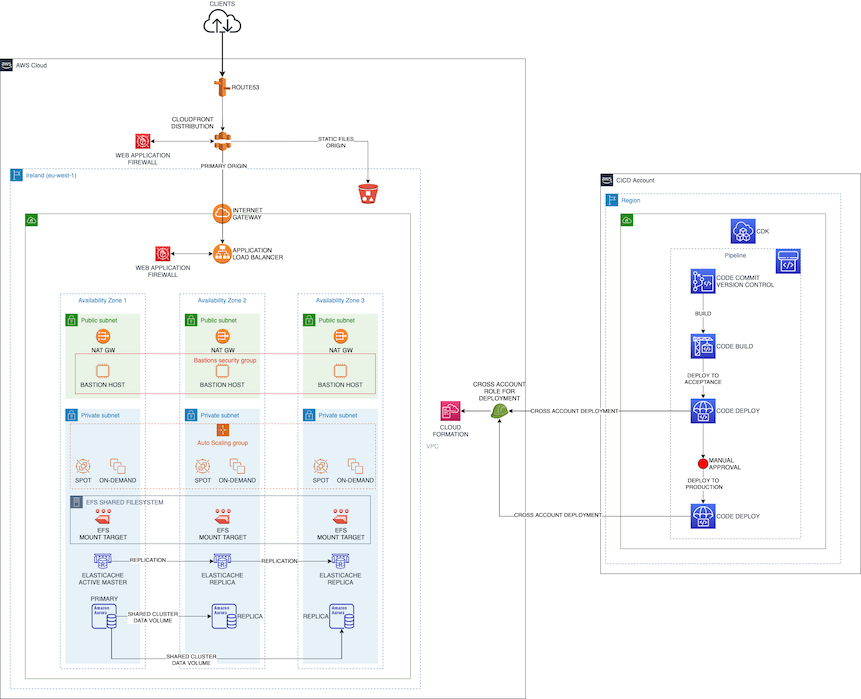

# AWS EMEA Solutions Architect Hiring Assignment

This repository is a proof-of-concept implementation of the proposed solution (short term) design for the assignment.

It includes the new Application Load Balancer with autoscaling group and scaling policy.

It also implements the static file serving separatation through CloudFront and an S3 bucket, including cross-region deployment of digital certificates for CloudFront.

The CDK pipeline implements cross-account deployment with automated roles creation and assume, using a plugin.

Since the solutions is based on CloudFront, which needs to have the SSL certificates in the North Virginia region, I implemented a cross-region cross-account deployment scheme.

Basically, there's a first bootstrapping sequence, where we need to create the subdomain public zones and the SSL certificates for the CloudFront distribution, for the test and production environment.

here we also bootstrap CDK for the required regions.

# Instructions

The current setup is based on three accounts: **cicd**, **test** and **prod**.

These accounts should be configured as AWS CLI profiles.

Make sure you have installed AWS CLI and CDK toolkit.

Configure **cdk.json** by replacing the entries *cicdAccount*, *testAccount* and *prodAccount* with the respective account IDs.

Bootstrap all the accounts across the selected regions:

- cicd on eu-west-1 only (no need to deploy the certificate for CloudFront)
- test and prod across us-west-1 and eu-west-1

`cdk bootstrap --profile <profile> --cloudformation-execution-policies arn:aws:iam::aws:policy/AdministratorAccess --trust <cicd account id> aws://<target account id>/<target region>`

In order to prepare the execution of the CDK pipeline across the accounts, the following commands need to be executed:

`cdk --profile <test profile> deploy --app "npx ts-node bin/required-resources.ts" test`

`cdk --profile <test profile> --app "npx ts-node bin/required-resources.ts" testCert`

`cdk --profile <prod profile> deploy --app "npx ts-node bin/required-resources.ts" prod`

`cdk --profile <prod profile> --app "npx ts-node bin/required-resources.ts" prodCert`

